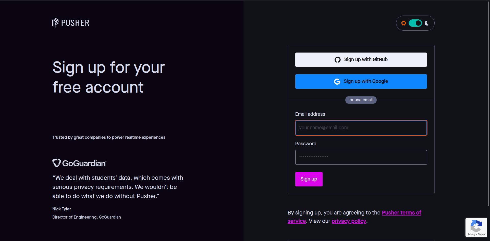
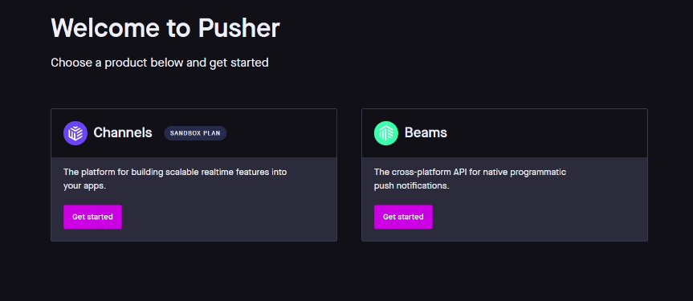
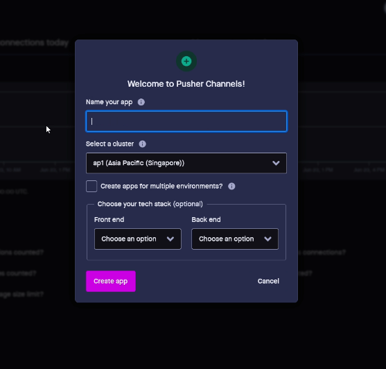
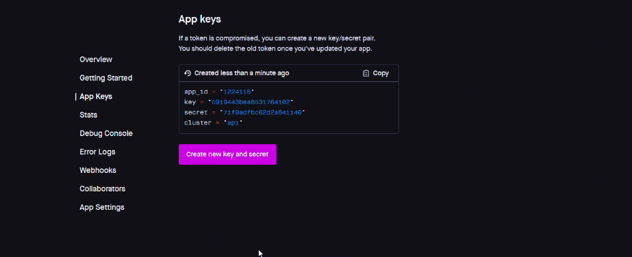
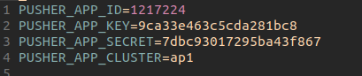
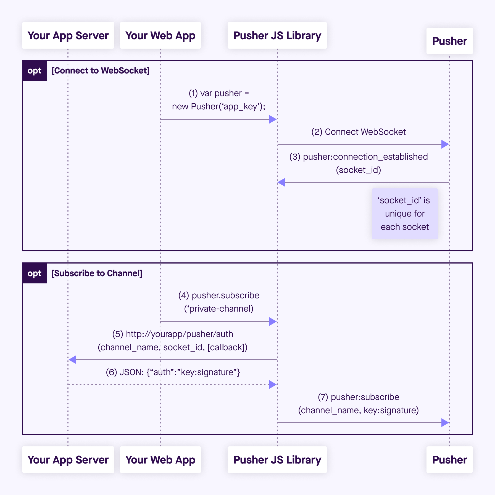

# Laravel broadcasting

[Kembali](../readme.md)

## Daftar isi

-   [Langkah 1] Daftar Pusher
-   [Langkah 2] Setup Environment
-   [Langkah 3] Setup Event
-   [Langkah 4] Setup Endpoint
-   [Langkah 5] Setup Frontend

## [Langkah 1] Daftar Pusher

Mendaftarkan akun di pusher.com



Setelah akun terdaftar, membuat Channels barus dengan menekan tombol "Get Started"


Kemudian mengisikan nama aplikasi dan menentukan cluster dari server pusher



Setelah channel pusher dibuat langkah selanjutnya adalah memasukan key kedalam file ".env"



## [Langkah 2] Setup Environment

Copy key yang sudah di dapat dari langkah sebelumnya kedalam file ".env"



## [langkah 3] Setup Event

Membuat sebuah event untuk trigger broadcast menggunakan command

**syntax**

```
php artisan make:event <nama_event>

```

**example**

```
php artisan make:event MessageSent

```

Event yang dibuat harus Extends class ShouldBroadcast

kemudian memberi sebuah event attribute yang akan digunakan saat broadcast

setelah attribute di set, langkah selanjutnya memberi nama event yang akan dikirim
ke pusher menggunakan function:

```php

    public function broadcastAs()
    {
        return "message_created_boi";
    }

```

lalu menentukan channel yang akan digunakan(ada 3 pilihan jenis channel):

1. Channel -> channel public yang tidak perlu authentication saat subscribe ke channel nya
1. PrivateChannel -> Channel yang memerlukan authentication saat subscribe ke channel nya
1. PresenceChannel -> Channel yang memerlukan authentication saat subscribe ke
   channel nya dan bisa melihat member siapa saja yang mensubscribe ke channel ini

example

```php
    public function broadcastOn()
    {
        return new PrivateChannel("message-notification");
    }
```

Kurang lebih class event keseluruhan sebagai berikut

```php
class MessageSent implements ShouldBroadcast
{
    use Dispatchable, InteractsWithSockets, SerializesModels;

    public string $message;
    public string $name_from;
    public string $time;

    /**
     * Create a new event instance.
     *
     * @return void
     */
    public function __construct(
        string $message,
        string $name_from,
        string $time
    ) {
        $this->message = $message;
        $this->name_from = $name_from;
        $this->time = $time;
    }

    public function broadcastAs()
    {
        return "message_created_boi";
    }

    /**
     * Get the channels the event should broadcast on.
     *
     * @return \Illuminate\Broadcasting\Channel|array
     */
    public function broadcastOn()
    {
        return new PrivateChannel("message-notification");
    }
}
```

## [Langkah 4] Setup Endpoint

Menyiapkan endpoint untuk broadcast event

endpoint yang disiapkan hanya routing biasa pada api laravel seperti berikut

endpoint ini dibuat di dalam file api.php

route lengkapnya untuk endpoint menjadi https://student-life.local/api/lets_meet/message

di dalam route tersebut aksi yang dilanjutkan hanyalah mentrigger sebuah event dengan cara

syntax

```php
return event([Object Event]);
```

example

```php
return event(
    new MessageSent(
        $request->input("message"),
        $request->input("name_from"),
        (new DateTime())->getTimestamp()
    )
);
```

kurang lebih routing lengkap nya menjadi seperti ini

```php
Route::post("/message", function (Request $request) {
    switch ($request->input("scope")) {
        case "private":
            return event(
                new MessageSent(
                    $request->input("message"),
                    $request->input("name_from"),
                    (new DateTime())->getTimestamp()
                )
            );
        case "public":
            return event(
                new MessageBroadcasted(
                    $request->input("message"),
                    $request->input("name_from"),
                    (new DateTime())->getTimestamp()
                )
            );
        case "presence":
        default:
            return event(
                new MessageSentRoom(
                    $request->input("message"),
                    $request->input("name_from"),
                    (new DateTime())->getTimestamp()
                )
            );
    }
});
```

Endpoint diatas hanya untuk mentrigger broadcast nya saja
setelah itu hal yang perlu dilakukan adalah setup endpoint untuk authentication pusher client

endpoint nya adalah

https://student-life.local/broadcasting/auth

diagram untuk setup authentication private channel seperti berikut



backend mengembalikan "auth" dengan format "key:signature"

key adalah app_key dari pusher

dan signature nya adalah "<socket_id>:<channel_name>"

kemudian signature di encrypt menggunakan sha256

lalu untuk authorization presence channel cukup ditambahkan json user dibelakang signature pertama

user_data berisi

example

```json
{
    "user_id": 10,
    "user_info": {
        "name" => "john"
    }
}
```

data yang di dalam user_info berisi terserah yang nanti bisa digunakan oleh frontend

"<socket_id>:<channel_name>:<user_data>"

## [Langkah 5] Setup Frontend

### Public & Private Channels
Untuk frontend, langkah" yang dilakukan adalah pertama dengan melakukan inisialisasi pusher ke cluster dan sesuai app_key yang di tentukan.

Library yang harus diinstall adalah `pusher-js` atau menggunakan command
```
yarn add pusher-js
```

Jika kita ingin menginisialisasi untuk **public**, maka inisialisasi hanya perlu sebagai berikut:
```js
const pusher = new Pusher(PUSHER_APP_KEY, {
  cluster: PUSHER_APP_CLUSTER,
  encrypted: true,
});
```

Sedangkan jika kita menggunakan **private**, maka harus menambahkan setup untuk authEndpoint dan auth headers. Jika ada authentikasi, kita dapat meletakkan token sebagai Authorization bearer di `headers`.
```js
// Only for React, pass csrf token in head.meta tags
const token = document.head.querySelector('meta[name="csrf-token"]').content;

const pusher = new Pusher(PUSHER_APP_KEY, {
  cluster: PUSHER_APP_CLUSTER,
  encrypted: true,
  authEndpoint: '/broadcasting/auth',
  auth: { headers: { 'X-CSRF-Token': token } },
});
```

> Jika menggunakan framework, maka kita harus melakukan passing csrf token ke head menggunakan blade

```html
<meta name="csrf-token" content="{{ csrf_token() }}" />
```

Setelah melakukan init, kita harus melakukan subscription ke channel. Jika channel merupakan private, maka dapat ditambahkan prefix `private-`

```js
// Channel Name
const channel = pusher.subscribe('message-notification');
```

Kemudian, membind dengan event yang akan masuk, nama event bisa langsung dikustomisasi dan kita bisa memilih event apa yang ingin kita bind sehingga kita mendapat data yang tidak tercampur". Fungsi callback pada `channel.bind`, akan terinvoke setiap kali ada event yang masuk ke pusher.

```js
// Event Name (new_product, new_friend_request)
channel.bind('message_created_boi', (data) => {
  // Set the data
  setChats((chats) => [...chats, data]);
});
```

Setelah menjalankan subscription dan bind event, maka kita bisa mendapatkan akses pada variable `chats` dalam kasus ini berupa React State dengan type sebagai berikut

```ts
const [chats, setChats] = useState<Chats[]>([]);

interface Chats {
  name_from: string;
  message: string;
}
```

Jika tidak menggunakan framework JS, maka bisa melakukan AJAX dan membuat dom node setiap kali ada chat yang masuk:

```js
function event_cb(data) {
  const e = document.createElement('div');
  e.innerHTML = data.message;
  document.doby.appendChild(e);
}
```


#### Demo pada Public Channel


#### Demo pada Private channel

Dapat kita lihat bahwa message yang dikirimkan ke channel berbeda, tidak akan masuk ke channel lain.

### Presence Channel

Sedangkan pada presence channel, ada event" yang bisa kita akses yang diberikan dari pusher yaitu:
- `pusher:subscription_succeeded` → triggered ketika berhasil subscribe
- `pusher:member_added` → triggered ketika ada user baru yang melakukan subscribe
- `pusher:member_removed` → triggered ketika ada user yang keluar
- `pusher:subscription_error` → triggered ketika gagal melakukan subscribe

Dengan event" di atas, maka kita bisa mem-bind dengan event tersebut dan melakukan update members, contoh code dibawah ini akan menggunakan React.js
```jsx
const [members, setMembers] = useState([]);

useEffect(() => {
  const token = document.head.querySelector(
    'meta[name="csrf-token"]'
  ).content;

  const username = window.prompt('Username (Presence): ', 'Anonymous');
  setUsername(username);

  // Disini karena kami tidak menggunakan auth, maka kami mengirimkan nama, jika ada authentication, maka bisa mengirimkan JWT token
  const pusher = new Pusher(PUSHER_APP_KEY, {
    cluster: PUSHER_APP_CLUSTER,
    encrypted: true,
    authEndpoint: '/broadcasting/auth',
    auth: { headers: { 'X-CSRF-Token': token, 'X-Name': username } },
  });

  const channel = pusher.subscribe('presence-message-notification');
  
  // Mendapatkan user online ketika pertama kali masuk
  channel.bind('pusher:subscription_succeeded', (member) => {
    const succeedMember = Object.keys(member.members);
    const cleanMember = succeedMember.filter((m) => m !== member.myID);
    setMembers(cleanMember);
  });

  // Menambahkan user baru pada members state
  channel.bind('pusher:member_added', (member) => {
    setMembers((prev) => [...prev, member.id]);
  });

  // Menghapus user yang keluar pada members state
  channel.bind('pusher:member_removed', (member) => {
    setMembers((prev) =>
      prev.filter((memberState) => memberState !== member.id)
    );
  });

  // Log jika subscription gagal
  channel.bind('pusher:subscription_error', (error) => {
    console.log(error);
  });

  channel.bind('message_created_boi', (data) => {
    setChats((chats) => [...chats, data]);
  });
}, []);
```

#### Demo pada Presence channel


