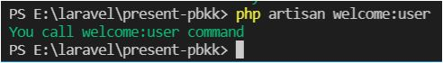
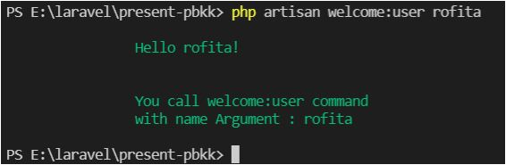
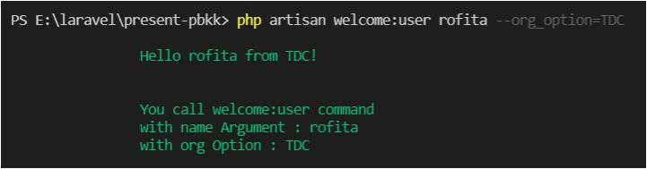

# Laravel Command

[Kembali](readme.md)

## Latar belakang topik

Saat bekerja dengan framework Laravel, tentunya kita tidak asing dengan perintah **php artisan**. Tanpa adanya perintah ini, Laravel tidak akan semudah sekarang. Terlebih lagi apabila kita bisa menambah perintah buatan kita sendiri kedalam perintah artisan ini. Bagi kita yang suka bekerja secara otomatis dan suka bekerja dengan command line, menambah perintah artisan akan dapat meningkatkan produktivitas.

## Konsep-konsep


Artisan adalah *command line interface* pada Laravel. Artisan menyediakan sejumlah perintah bermanfaat yang dapat membantu saat membangun aplikasi. Untuk melihat daftar semua perintah Artisan yang tersedia, Anda dapat menggunakan list command:

```
php artisan list
```

Setiap perintah juga memiliki layanan "help" yang menampilkan dan menjelaskan argumen dan opsi perintah yang tersedia. Untuk melihat bantuan, awali nama perintah dengan help, contohnya:

```
php artisan help migrate
```
Untuk menambah perintah artisan gunakan perintah ini di command line

```
php artisan make:command command_name
```

## Langkah-langkah tutorial

### Langkah pertama : Membuat Command
Membuat command dengan nama WelcomeUserCommand dengan perintah dibawah: 
```
php artisan make:command WelcomeUserCommand
```

### Langkah kedua : Struktur Command 
Maka Laravel akan membuat file dengan nama WelcomeUserCommand.php di folder app/Console/Commands dengan isi sebagai berikut

```php
namespace App\Console\Commands;
 
use Illuminate\Console\Command;
 
class WelcomeUserCommand extends Command
{
    /**
     * The name and signature of the console command.
     *
     * @var string
     */
    protected $signature = 'command:name';
 
    /**
     * The console command description.
     *
     * @var string
     */
    protected $description = 'Command description';
 
    /**
     * Create a new command instance.
     *
     * @return void
     */
    public function __construct()
    {
        parent::__construct();
    }
 
    /**
     * Execute the console command.
     *
     * @return mixed
     */
    public function handle()
    {
        //
    }
}
```

property `$signature` adalah yang nantinya menjadi panduan dari command untuk dipanggil lewat perintah artisan. 
Apabila kita mengisi sebagai berikut:

```
protected $signature = 'welcome:user';
```

Maka pada command line nantinya kita bisa memanggil perintah artisan dengan cara seperti ini

```
php artisan welcome:user
```

Selanjutnya kita dapat mengisi property `$description`, untuk menjelaskan mengenai kegunaan command ini

```
protected $description = 'Say Hello to User';
```


### Langkah ketiga : Check List Command

Selanjunya pastikan perintah `welcome:user` yang baru saja kita buat sudah terdaftar dengan mengetikkan perintah

```
php artisan list
```

Maka terlihat bahwa perintah `welcome:user` yang baru saja kita buat sudah terdaftar.

### Langkah keempat : Mengatur Isi Command

Saat perintah di panggil lewat perintah artisan laravel akan mengeksekusi method `handle()` pada file command di folder **app/Console/Commands**. Oleh karena itu tempatkan logic command di method ini. Sebagai contoh kita tampilkan pesan sederhana seperti dibawah ini

```php
public function handle()
{
    $this->info('You call welcome:user command');
}
```

Selanjutnya kita test, maka akan muncul seperti ini :

> 

Kita juga bisa menambahkan **positional argumen** pada perintah yang kita buat seperti dibawah ini
    
```php
protected $signature = '
        welcome:user
        {name_argument}
    ';
```
**Positional argument** adalah argument yang dibaca berdasarkan posisi argument itu diketik di console. Biasanya positional argument di pisahkan dengan spasi.

Untuk mendapatkan argument yang diketik user gunakan kode seperti dibawah ini

```php
public function handle()
{
    $name_argument = $this->argument('name_argument');
     
    $this->info("
            Hello {$name_argument}!\n\n
        
            You call welcome:user command \n
            with name Argument : {$name_argument}
        ");
}
```

maka ketika command dipanggil akan muncul seperti dibawah ini

> 

Kita juga bisa membuat nilai **default** untuk argumen yang ada seperti ini :

```php
protected $signature = '
    welcome:user
    {name_argument=Caca}
';
```

Sehingga jika kita tidak mengisi name_argument secara otomatis nilainya akan diisi Caca.

Selain argument kita juga bisa menggunakan keyword **option** seperti dibawah ini

```php
protected $signature = '
    welcome:user
    {name_argument=Caca}
    {--org_option=ITS}
';
```

Berbeda dengan **argument**, penulisan **option** bebas tidak harus sesuai dengan urutan posisinya, tapi harus ditulis setelah **positional argument** selesai ditulis semua


Untuk mendapatkan option dan argumen yang diketik user kita bisa menggunakan perintah seperti dibawah ini:

```php
public function handle()
{
    // mengambil argumen tertentu
    $name_argument = $this->argument('name_argument');
 
    // mengambil opsi tertentu
    $org_option = $this->option('org_option');
     
    $this->info("
            Hello {$name_argument} from {$org_option}!\n

            You call welcome:user command 
            with name Argument : {$name_argument}
            with org Option : {$org_option}
        ");
}
```

> 

Apabila kita ingin mengambil semua argumen ataupun semua option sebagai sebuah array dapat sebagai berikuts 

```php
    // mengambil semua argumen sebagai array
    $arguments = $this->arguments();

    // mengambil semua opsi sebagai array
    $options = $this->options();
```

Selain itu, kita juga dapat meminta pengguna untuk memberikan input selama eksekusi command menggunakan `ask`, contohnya seperti dibawah :

```php
public function handle()
{
    $name = $this->ask('What is your name?');
}
```

Apabila kita ingin input pengguna tidak terlihat, kita dapat menggunakan `secret` seperti dibawah :

```php
$password = $this->secret('What is the password?');
```

Apabila kita ingin meminta konfirmasi saja dari user, kita dappat menggunakan method `confirm`. 
Yang mmana secara default, metode ini akan mengembalikan **false**. Namun, jika pengguna masuk `y` atau `yes` sebagai respons terhadap prompt, metode akan kembali **true**.

```php
    if ($this->confirm('Do you wish to continue?')) {
        $this->info("Ok Continue");
    } else {
        $this->error("Stop Process");
    }
```

### Menjalankan perintah Artisan di luar CLI

Misalkan kita ingin menjalankan perintah Artisan dari route atau contoller. kita dapat menggunakan `call` method pada Facades Artisan. Contohnya sebagai berikut :

```php
use Illuminate\Support\Facades\Artisan;

Route::get('/user/{user}/welcome', function ($user) {
    $exitCode=Artisan::call('welcome:user', [
        'name_argument' => $user, '--org_option' => 'ITS'
    ]);

    if(!$exitCode){
        echo "command sukses";
    }
});
```

### Kustomisasi Stub

Command Artisan `make` digunakan untuk membuat berbagai kelas, seperti controller, migration, dan lain lain. Kelas-kelas ini dihasilkan melalui file "stub". Apabila kita ingin membuat sedikit perubahan-perubahan pada file yang dihasilkan oleh Artisan. Kita dapat menggunakan command `stub:publish` untuk memupublish stubs yang paling umum ke aplikasi kita agar kita dapat menyesuaikannya. Kita dapat menjalankan :

```
php artisan stub:publish
```

Sehingga akan muncul direktori `stubs` di root aplikasi kita.

Misalkan kita ingin menambah `__invoke()` function pada setiap controller yang dihasilkan oleh Artisan. Maka kita dapat merubah stub file `controller.plain.stub` sebagai berikut : 

```php
class {{ class }} extends Controller
{
    public function __invoke()
    {

    }
}
```

Kemudian kita jalankan 

```
php artisan make:controller StubsTestController
```

Maka file StubsTestController yang terbuat akan memiliki function `__invoke()`

```php

namespace App\Http\Controllers;

use Illuminate\Http\Request;

class StubsTestController extends Controller
{
    public function __invoke()
    {

    }
}

```

