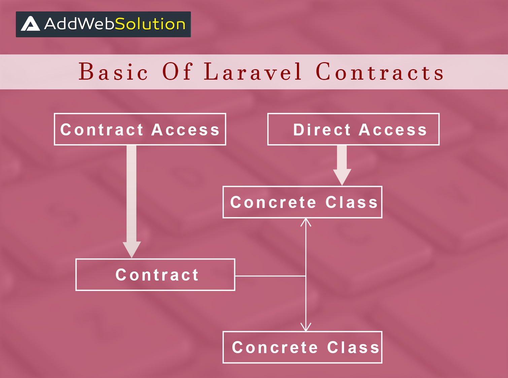

# Topik 1

[Kembali](readme.md)

## Latar belakang topik

Misal: jelaskan mengenai latar belakang, alasan penggunaan, dll.

## Konsep-konsep

**Contract** adalah nama lain dari `php interfaces`. Hal ini  dipakai untuk membantu kita membuat loosely coupled code base. Pencipta Laravel, Taylor Otwell menghadirkan fitur luar biasa di Laravel 5 yang disebut Kontrak. Kontrak adalah seperangkat antarmuka yang membantu pengembang untuk membuat kode yang *loosely coupled* ATAU dalam istilah lain kita dapat mengatakan bahwa Kontrak adalah antarmuka yang menyediakan *core services*.

Jadi secara umum, Laravel Contracts adalah pembungkus antarmuka berbeda yang dimiliki oleh `illuminate/contracts`.



Di sini, terdapat contoh code yang tidak menggunakan `Contracts`. Kapan saja kita *instantiate* `Repository` kita memberikan instance `\SomePackage\Cache\Memcached` untuk memenuh dependency `Repository`. Cara ini menghasilkan code yang *tightly coupled* dengan `\SomePackage\Cache\Memcached`. Contoh: 

```php
<?php
namespace \SomePackage\Cache;

class Memcached
{
    // Check if cache exists in memory
    function pull($key) {
        // TODO:
    }

}
```

```php
<?php

namespace App\Orders;

class Repository
{
    // The cache instance.
    protected $cache;

    public function __construct(\SomePackage\Cache\Memcached $cache)
    {
        $this->cache = $cache;
    }

    public function find($key)
    {
        if ($this->cache->pull($key)) {
            // Logic if cache exists
        }
    }
}
```

Masalah dengan code yang *tightly coupled* adalah saat kita ingin mengubah code, misal jika kita ingin mengganti cache dari `Memcached` menjadi `RedisCache`, kita harus mengubah code di `Repository`. Dengan `Contracts` kita tidak perlu mengganti code di `Repository`, contoh:

Buat `Memcached` dan `RedisCache` yang *implements* Cache
```php
<?php

namespace App\Contracts;

use Illuminate\Contracts\Cache\Repository as Cache;

class Memcached implements Cache
{
    // Check if cache exists in memory
    function pull($key) {
        // TODO:
    }
}
```


```php
<?php

namespace App\Contracts;

use Illuminate\Contracts\Cache\Repository as Cache;

class RedisCache implements Cache {

    // Check if cache exists in redis
    function pull($key) {
        // TODO: 
    }
}
```

Hasil `Repository` menggunakan `Contracts`

```php
<?php

namespace App\Orders;

use Illuminate\Contracts\Cache\Repository as Cache;

class Repository
{
    // The cache instance.
    protected $cache;

    public function __construct(Cache $cache)
    {
        $this->cache = $cache;
    }

    public function find($key)
    {
        if ($this->cache->pull($key)) {
            // Logic if cache exists
        }
    }

}
```

Jika lebih lanjut kita ingin menambah `FileCache` kita hanya perlu menambah Class, tidak perlu mengubah code di class `Repository`. Selain itu:

### Membuat Contracts
```php
<?php

namespace App\Modules\Ui\Contracts;

interface BladeMenu
{
    public function renderMenu(): string;
}
```


### Memakai Contracts
```php
<?php

namespace App\Modules\Kontrak;

use App\Modules\Ui\Contracts\BladeMenu;
use Dptsi\Modular\Base\BaseModule;

class KontrakModule extends BaseModule implements BladeMenu
{
    public function renderMenu()
    {
        return view("Kontrak::menu")->render();
    }
}
```

### Memakai Contracts Bawaan Laravel
```php
use Illuminate\Http\Request;
use App\Http\Requests;
use App\Http\Controllers\Controller;
use Illuminate\Contracts\Auth\Guard as Auth;

class StoreController extends Controller
{
    /**
     * Display a listing of the resource.
     *
     * @return Response
     */
    protected $auth;

    public function __construct(Auth $auth) {//Inject `Auth` Facade...
    	$this­->auth = $auth;  	 
    }

    public function insert(Request $request)
    {
    	$this­->auth­->attempt();	 
    }
}
```

## Contract Reference
Laravel sudah menyediakan beberapa `Contracts`

|Contract	|	References Facade|
|---|---|
|Illuminate\Contracts\Auth\Access\Authorizable	|	  |
|Illuminate\Contracts\Auth\Access\Gate	|	Gate|
|Illuminate\Contracts\Auth\Authenticatable	|	  |
|Illuminate\Contracts\Auth\CanResetPassword	|	 |
|Illuminate\Contracts\Auth\Factory	|	Auth|
|Illuminate\Contracts\Auth\Guard	|	Auth::guard()|
|Illuminate\Contracts\Auth\PasswordBroker	|	Password::broker()|
|Illuminate\Contracts\Auth\PasswordBrokerFactory	|	Password|
|Illuminate\Contracts\Auth\StatefulGuard	|	 |
|Illuminate\Contracts\Auth\SupportsBasicAuth	|	 |
|Illuminate\Contracts\Auth\UserProvider	|	 |
|Illuminate\Contracts\Bus\Dispatcher	|	Bus|
|Illuminate\Contracts\Bus\QueueingDispatcher	|	Bus::dispatchToQueue()|
|Illuminate\Contracts\Broadcasting\Factory	|	Broadcast|
|Illuminate\Contracts\Broadcasting\Broadcaster	|	Broadcast::connection()|
|Illuminate\Contracts\Broadcasting\ShouldBroadcast	|	 |
|Illuminate\Contracts\Broadcasting\ShouldBroadcastNow	|	 |
|Illuminate\Contracts\Cache\Factory	|	Cache|
|Illuminate\Contracts\Cache\Lock	|	 |
|Illuminate\Contracts\Cache\LockProvider	|	 |
|Illuminate\Contracts\Cache\Repository	|	Cache::driver()|
|Illuminate\Contracts\Cache\Store	|	 |
|Illuminate\Contracts\Config\Repository	|	Config|
|Illuminate\Contracts\Console\Application	|	 |
|Illuminate\Contracts\Console\Kernel	|	Artisan|
|Illuminate\Contracts\Container\Container	|	App|
|Illuminate\Contracts\Cookie\Factory	|	Cookie|
|Illuminate\Contracts\Cookie\QueueingFactory	|	Cookie::queue()|
|Illuminate\Contracts\Database\ModelIdentifier	|	 |
|Illuminate\Contracts\Debug\ExceptionHandler	|	 |
|Illuminate\Contracts\Encryption\Encrypter	|	Crypt|
|Illuminate\Contracts\Events\Dispatcher	|	Event|
|Illuminate\Contracts\Filesystem\Cloud	|	Storage::cloud()|
|Illuminate\Contracts\Filesystem\Factory	|	Storage|
|Illuminate\Contracts\Filesystem\Filesystem	|	Storage::disk()|
|Illuminate\Contracts\Foundation\Application	|	App|
|Illuminate\Contracts\Hashing\Hasher	|	Hash|
|Illuminate\Contracts\Http\Kernel	|	 |
|Illuminate\Contracts\Mail\MailQueue	|	Mail::queue()|
|Illuminate\Contracts\Mail\Mailable	|	 |
|Illuminate\Contracts\Mail\Mailer	|	Mail|
|Illuminate\Contracts\Notifications\Dispatcher	|	Notification|
|Illuminate\Contracts\Notifications\Factory	|	Notification|
|Illuminate\Contracts\Pagination\LengthAwarePaginator	|	 |
|Illuminate\Contracts\Pagination\Paginator	|	 |
|Illuminate\Contracts\Pipeline\Hub	|	 |
|Illuminate\Contracts\Pipeline\Pipeline	|	 |
|Illuminate\Contracts\Queue\EntityResolver	|	 |
|Illuminate\Contracts\Queue\Factory	|	Queue|
|Illuminate\Contracts\Queue\Job	|	 |
|Illuminate\Contracts\Queue\Monitor	|	Queue|
|Illuminate\Contracts\Queue\Queue	|	Queue::connection()|
|Illuminate\Contracts\Queue\QueueableCollection	|	 |
|Illuminate\Contracts\Queue\QueueableEntity	|	 |
|Illuminate\Contracts\Queue\ShouldQueue	|	 |
|Illuminate\Contracts\Redis\Factory	|	Redis|
|Illuminate\Contracts\Routing\BindingRegistrar	|	Route|
|Illuminate\Contracts\Routing\Registrar	|	Route|
|Illuminate\Contracts\Routing\ResponseFactory	|	Response|
|Illuminate\Contracts\Routing\UrlGenerator	|	URL|
|Illuminate\Contracts\Routing\UrlRoutable	|	 |
|Illuminate\Contracts\Session\Session	|	Session::driver()|
|Illuminate\Contracts\Support\Arrayable	|	 |
|Illuminate\Contracts\Support\Htmlable	|	 |
|Illuminate\Contracts\Support\Jsonable	|	 |
|Illuminate\Contracts\Support\MessageBag	|	 |
|Illuminate\Contracts\Support\MessageProvider	|	 |
|Illuminate\Contracts\Support\Renderable	|	 |
|Illuminate\Contracts\Support\Responsable	|	 |
|Illuminate\Contracts\Translation\Loader	|	 |
|Illuminate\Contracts\Translation\Translator	|	Lang|
|Illuminate\Contracts\Validation\Factory	|	Validator|
|Illuminate\Contracts\Validation\ImplicitRule	|	 |
|Illuminate\Contracts\Validation\Rule	|	 |
|Illuminate\Contracts\Validation\ValidatesWhenResolved	|	 |
|Illuminate\Contracts\Validation\Validator	|	Validator::make()|
|Illuminate\Contracts\View\Engine	|	 |
|Illuminate\Contracts\View\Factory	|	View|
|Illuminate\Contracts\View\View	|	View::make()|

https://laravel.com/docs/8.x/contracts#contract-reference

## Langkah-langkah tutorial

### Langkah pertama
Buat interface `BladeMenu`

```php
<?php

namespace App\Contracts;

interface BladeMenu
{
    public function renderMenu(): string;
}
```
<!-- 
Buat class `Memcached` dan `Redis`

```php
<?php

namespace App\Contracts;

use Illuminate\Contracts\Cache\Repository as Cache;

class Memcached implements Cache
{
    // Check if cache exists in memory
    function pull() {
        return "Ambil data dari Memcached";
    }
}
```


```php
<?php

namespace App\Contracts;

use Illuminate\Contracts\Cache\Repository as Cache;

class RedisCache implements Cache {

    // Check if cache exists in redis
    function pull() {
        return "Ambil data dari RedisCache";
    }
}
``` -->

### Langkah kedua
Buat class `FirstMenu` dan `SecondMenu` yang *implements* `BladeMenu`. Buat class `NotMenu` biasa
```php
<?php

namespace App\Menus;

use App\Contracts\BladeMenu;

class FirstMenu implements BladeMenu
{
    public function renderMenu()
    {
        return 'first menu';
    }
}
```

```php
<?php

namespace App\Menus;

use App\Contracts\BladeMenu;

class SecondMenu implements BladeMenu
{
    public function renderMenu()
    {
        return 'this is the second menu';
    }
}
```

```php
<?php

namespace App\Menus;

use App\Contracts\BladeMenu;

class NotMenu implements BladeMenu
{
    public function renderMenu()
    {
        return 'not a menu';
    }
}
```


### Langkah ketiga
Masukkan code yang menggunakan class menus

```php
<?php
use Illuminate\Http\Request;
use Illuminate\Routing\Controller;
use App\Contracts\BladeMenu;
use App\Menus\FirstMenu;
use App\Menus\SecondMenu;
use App\Menus\NotMenu;


class KontrakController extends Controller
{
    public function menus()
    {
        $menus[] = new FirstMenu();
        $menus[] = new NotMenu();
        $menus[] = new SecondMenu();

        $result = "";
        foreach ($menus as $menu) {
            if ($menu instanceof BladeMenu) {
                $result = $result."{$menu->renderMenu()}<br>";
            }
        }
        return $result;
    }
}
```

## Referensi
https://stackoverflow.com/questions/41994778/create-contracts-in-laravel-5-4
https://addwebsolution.com/blog/understand-basic-laravel-contracts
