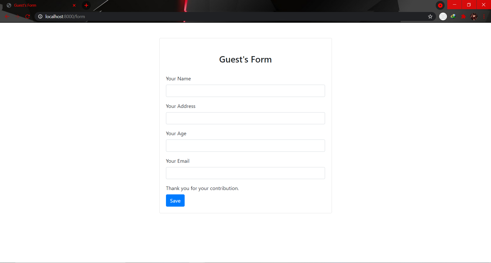
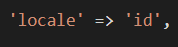
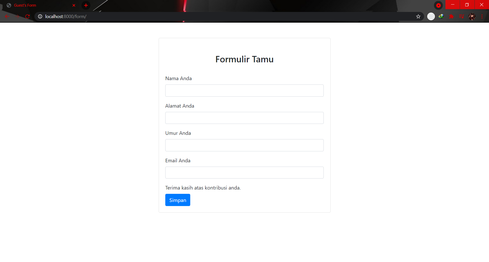
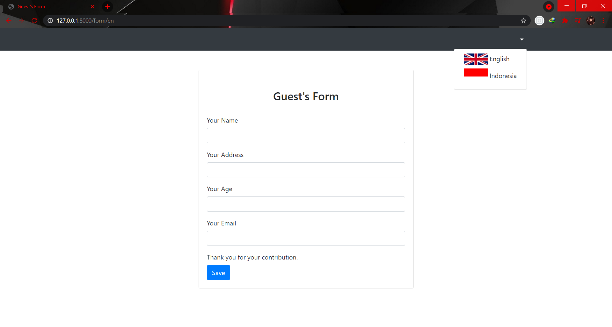
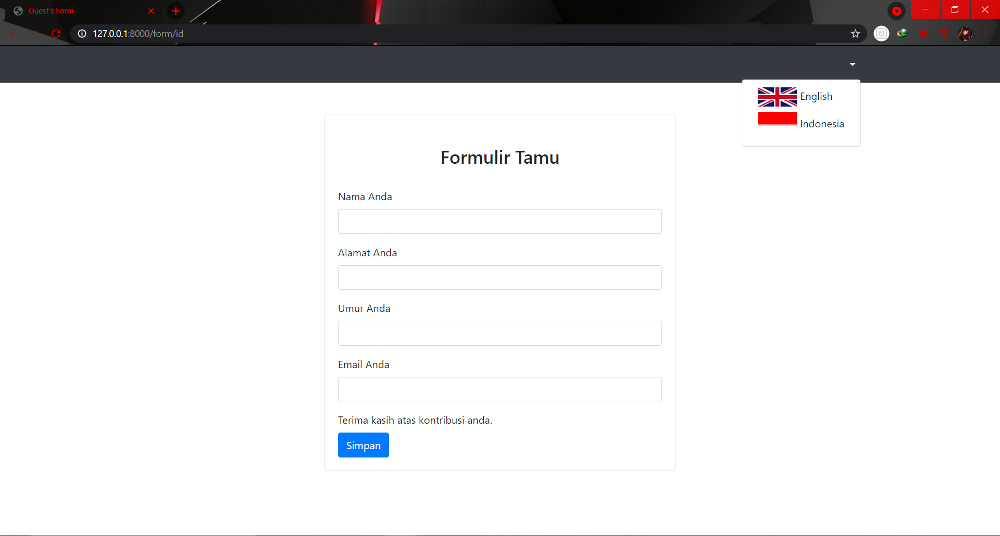

# Laravel Localization

[Kembali](readme.md)

## Latar belakang topik

Bahasa adalah kemampuan yang dimiliki manusia untuk berkomunikasi dengan manusia lainnya menggunakan tanda, misalnya kata dan gerakan. Perkiraan jumlah bahasa di dunia beragam antara 6.000–7.000 bahasa. Namun, perkiraan tepatnya bergantung pada suatu perubahan sembarang yang mungkin terjadi antara bahasa dan dialek. Bahasa manusia unik karena memiliki sifat-sifat produktivitas, rekursif, dan pergeseran, dan karena secara keseluruhan bahasa manusia bergantung pula pada konvensi serta edukasi sosial. Strukturnya yang kompleks mampu memberikan kemungkinan ekspresi dan penggunaan yang lebih luas daripada sistem komunikasi hewan yang diketahui.

## Konsep-konsep

Laravel menyediakan fitur lokalisasi yang memudahkan untuk mengambil string dalam berbagai bahasa, memungkinkan kita untuk dengan mudah mendukung beberapa bahasa dalam aplikasi kita.

Laravel menyediakan dua cara untuk mengelola string terjemahan. Pertama, string bahasa dapat disimpan dalam file di dalam direktori `resources/lang`. Dalam direktori ini, terdapat subdirektori untuk setiap bahasa yang didukung oleh aplikasi. Ini adalah pendekatan yang digunakan Laravel dalam mengelola string terjemahan untuk fitur bawaan Laravel seperti validasi pesan kesalahan. Kedua, string terjemahan dapat didefinisikan dalam file JSON yang ditempatkan di dalam direktori ` resources/lang`. Saat mengambil pendekatan ini, setiap bahasa yang didukung oleh aplikasi kita akan memiliki file JSON yang sesuai di dalam direktori ini. Cara ini direkomendasikan unutk aplikasi yang berskala besar.

### Mengonfigurasi Lokal

Bahasa default untuk aplikasi kita disimpan dalam file konfigurasi `config/app.php` bagian `locale`. Kita bebas mengubah nilai ini agar sesuai dengan kebutuhan aplikasi kita.

Kita  dapat mengubah bahasa default untuk satu permintaan HTTP saat dijalankan menggunakan metode `setLocale` yang disediakan oleh Laravel
```php
use Illuminate\Support\Facades\App;

Route::get('/greeting/{locale}', function ($locale) {
    if (! in_array($locale, ['en', 'es', 'fr'])) {
        abort(400);
    }

    App::setLocale($locale);

    //
});
```

### Mendefinisikan String Terjemahan
#### Short Keys
Mendefinisikan string terjemahan menggunakan short key caranya dengan membuat array yang memiliki **key** dan **value**.

```php
<?php

// resources/lang/en/messages.php

return [
    'welcome' => 'Welcome to our application!',
];
```
#### String Terjemahan Sebagai Key
Untuk aplikasi dengan skala besar, mendefinisikan setiap string dengan "short key" dapat membingungkan kita ketika merujuk key dalam view kita dan akan rumit untuk terus-menerus menemukan key untuk setiap string terjemahan yang didukung oleh aplikasi kita.

Karena itu, Laravel dapat mendefinisikan string terjemahan menggunakan terjemahan "default" dari string sebagai key. File terjemahan yang menggunakan string terjemahan sebagai key disimpan sebagai file JSON di direktori `resources/lang`.
```php
{
    "I love programming.": "Saya suka pemrograman."
}
```
### Memanggil String Terjemahan
Kita dapat mengambil string terjemahan dari file bahasa kita menggunakan fungsi pembantu __ . Jika kita menggunakan "short keys" untuk mendefinisikan string terjemahan, kita harus mempassing file yang berisi key dan key itu sendiri ke fungsi __ menggunakan sintaks "." . Sebagai contoh, mari kita panggil string terjemahan welcome dari file bahasa `resources/lang/en/messages.php`.
```php
echo __('messages.welcome');
```
Jika kita menggunakan string terjemahan default sebagai key, kita harus mempassing string terjemahan default ke fungsi __ .
```php
echo __('I love programming.');
```
Jika view kita menggunakan template blade, gunakan sintaks {{ }} untuk menampilkan string terjemahan.
```php
{{ __('I love programming.') }}
```
#### Parameter Dalam String Terjemahan
Jika diinginkan, kita dapat menentukan placeholder dalam string terjemahan kita. Semua placeholder diawali dengan :. Misalnya, kita mau mendefinisikan pesan welcome dengan placeholder nama.
```php
'welcome' => 'Welcome, :name',
```
Untuk mengganti placeholder saat memanggil string terjemahan, kita dapat mempassing array pengganti sebagai argumen kedua pada fungsi __ .
```php
echo __('messages.welcome', ['name' => 'dayle']);
```
Jika placeholder kita berisi semua huruf kapital, atau hanya huruf pertama yang dikapitalisasi, pengganti yang diterjemahkan akan menyesuaikan.
```php
'welcome' => 'Welcome, :NAME', // Welcome, DAYLE
'goodbye' => 'Goodbye, :Name', // Goodbye, Dayle
```
#### Pluralisasi
Pluralisasi adalah masalah yang kompleks, karena bahasa yang berbeda memiliki berbagai aturan kompleks untuk pluralisasi; namun, Laravel dapat membantu kita menerjemahkan string secara berbeda berdasarkan aturan pluralisasi yang kita tetapkan. Menggunakan karakter |, kita dapat membedakan bentuk tunggal dan jamak dari string.
```php
'apples' => 'There is one apple|There are many apples',
```
```php
{
    "There is one apple|There are many apples": "Ada satu apel|Ada banyak apel"
}
```
Kita bahkan dapat membuat aturan pluralisasi yang lebih kompleks yang menentukan string terjemahan untuk beberapa rentang nilai.
```php
'apples' => '{0} There are none|[1,19] There are some|[20,*] There are many',
```
Setelah menentukan string terjemahan yang memiliki opsi pluralisasi, kita dapat menggunakan fungsi trans_choice untuk memanggil sesuai "jumlah" yang diberikan.
```php
echo trans_choice('messages.apples', 10);
```
Kita juga dapat menentukan atribut placeholder dalam string pluralisasi. Placeholder ini dapat diganti dengan mempassing array sebagai argumen ketiga pada fungsi trans_choice.
```php
'minutes_ago' => '{1} :value minute ago|[2,*] :value minutes ago',

echo trans_choice('time.minutes_ago', 5, ['value' => 5]);
```
### Mengganti Paket File Bahasa
Beberapa paket mungkin memiliki file bahasanya sendiri. Daripada mengubah beberapa baris pada inti file paket, kita dapat menimpanya dengan menempatkan file di direktori ` resources/lang/vendor/{package}/{locale}`.
Contoh, jika kita ingin menimpa string terjemahan bahasa inggris pada messages.php untuk paket `skyrim/heathfire`, kita harus menempatkan file bahasa pada `resources/lang/vendor/hearthfire/en/messages.php`. Dalam file ini, kita hanya harus menentukan string terjemahan yang ingin kita timpa. Setiap string terjemahan yang tidak kita timpa akan tetap dimuat dari file bahasa asli paket.

## Langkah-langkah tutorial

### Langkah pertama

Buat file baru untuk menyimpan string terjemahan. Untuk contoh disini menggunakan 2 bahasa yaitu bahasa inggris dan bahasa indonesia.
`resources/lang/en/form.php`
`resources/lang/id/form.php`


```php
<?php

// resources/lang/en/form.php

return [
	"title" => "Guest's Form",
	"profile" => [
		"name" => "Your Name",
		"address" => "Your Address",
		"age" => "Your Age",
		"email" => "Your Email",
	],
	"button" => "Save",
	"thank" => "Thank you for your contribution.",
];
```
```php
<?php

// resources/lang/id/form.php

return [
	"title" => "Formulir Tamu",
	"profile" => [
		"name" => "Nama Anda",
		"address" => "Alamat Anda",
		"age" => "Umur Anda",
		"email" => "Email Anda",
	],
	"button" => "Simpan",
	"thank" => "Terima kasih atas kontribusi anda.",
];
```

### Langkah kedua

Buat view baru dengan nama `formulir.blade.php`

```php
<!doctype html>
<html>

<head>
    <meta charset="utf-8">
    <meta name="viewport" content="width=device-width, initial-scale=1, shrink-to-fit=no">

    <link rel="stylesheet" href="https://cdn.jsdelivr.net/npm/bootstrap@4.6.0/dist/css/bootstrap.min.css" integrity="sha384-B0vP5xmATw1+K9KRQjQERJvTumQW0nPEzvF6L/Z6nronJ3oUOFUFpCjEUQouq2+l" crossorigin="anonymous">

    <title>Guest's Form</title>
</head>

<body>
    <div class="container">
        <div class="row justify-content-center">
            <div class="col-lg-6">
                <div class="card mt-5">
                    <h3 class="card-title text-center mt-5">
                        {{__('form.title')}}
                    </h3>
                    <div class="card-body">
                        <form>
                            @csrf
                            <div class="form-group">
                                <label>{{__('form.profile.name')}}</label>
                                <input type="text" class="form-control" name="">
                            </div>
                            <div class="form-group">
                                <label>{{__('form.profile.address')}}</label>
                                <input type="text" class="form-control" name="">
                            </div>
                            <div class="form-group">
                                <label>{{__('form.profile.age')}}</label>
                                <input type="text" class="form-control" name="">
                            </div>
                            <div class="form-group">
                                <label>{{__('form.profile.email')}}</label>
                                <input type="text" class="form-control" name="">
                            </div>
                            <div>
                                <label>{{__('form.thank')}}</label>
                            </div>
                            <button type="submit" class="btn btn-primary">{{__('form.button')}}</button>
                        </form>
                    </div>
                </div>
            </div>
        </div>
    </div>

    <script src="https://code.jquery.com/jquery-3.5.1.slim.min.js" integrity="sha384-DfXdz2htPH0lsSSs5nCTpuj/zy4C+OGpamoFVy38MVBnE+IbbVYUew+OrCXaRkfj" crossorigin="anonymous"></script>
    <script src="https://cdn.jsdelivr.net/npm/bootstrap@4.6.0/dist/js/bootstrap.bundle.min.js" integrity="sha384-Piv4xVNRyMGpqkS2by6br4gNJ7DXjqk09RmUpJ8jgGtD7zP9yug3goQfGII0yAns" crossorigin="anonymous"></script>

</body>

</html>
```

### Langkah ketiga

Buat route baru untuk menampilkan view yang telah kita buat.
```php
Route::get('/form', function () {
    return view('formulir');
});
```
Lalu kita coba jalankan dengan mengakses `http://127.0.0.1:8000/form`

Formulir masih dalam bahasa inggris
### Langkah keempat

Mengubah bahasa default Laravel pada `config/app.php` dengan id



Lalu kita jalankan kembali `http://127.0.0.1:8000/form`

Formulir berubah menjadi bahasa indonesia

### Langkah keempat

Disini kita akan membuat agar user dapat memilih bahasa yang diinginkan.
Buat controller baru. Tambahkan fungsi index dan `use Illuminate\Support\Facades\App;` seperti berikut.

`php artisan make:controller LocalizationController`

```php
<?php

namespace App\Http\Controllers;

use Illuminate\Http\Request;
use Illuminate\Support\Facades\App;

class LocalizationController extends Controller
{
    public function index($locale){
        App::setlocale($locale);
        session()->put('locale', $locale);
        return redirect()->back();
    }
}
```

### Langkah kelima

Buat middleware baru. Tambahkan if statement dan `use Illuminate\Support\Facades\App;` seperti berikut.

`php artisan make:middleware Localization`

```php
<?php

namespace App\Http\Middleware;

use Closure;
use Illuminate\Http\Request;
use Illuminate\Support\Facades\App;

class Localization
{
    /**
     * Handle an incoming request.
     *
     * @param  \Illuminate\Http\Request  $request
     * @param  \Closure  $next
     * @return mixed
     */
    public function handle(Request $request, Closure $next)
    {
        if (session()->has('locale')) {
            App::setlocale(session()->get('locale'));
        }
        return $next($request);
    }
}
```
### Langkah keenam

Tambahkan middleware ke `kernel.php` pada middlewareGroups.
```php
protected $middlewareGroups = [
        'web' => [
            \App\Http\Middleware\EncryptCookies::class,
            \Illuminate\Cookie\Middleware\AddQueuedCookiesToResponse::class,
            \Illuminate\Session\Middleware\StartSession::class,
            // \Illuminate\Session\Middleware\AuthenticateSession::class,
            \Illuminate\View\Middleware\ShareErrorsFromSession::class,
            \App\Http\Middleware\VerifyCsrfToken::class,
            \Illuminate\Routing\Middleware\SubstituteBindings::class,
            \App\Http\Middleware\Localization::class,
        ],
```

### Langkah ketujuh

Buat route baru untuk mengakses LocalizationController dan mempassing locale ke fungsi index.
```php
Route::get('/form/{locale}', 'App\Http\Controllers\LocalizationController@index');
```

### Langkah kedelapan

Selanjutnya disini kita tambahkan kode pada view `formulir.blade.php` untuk menggunakan dropdown dalam pemilihan bahasa.
```php
<nav class="navbar navbar-expand-lg navbar-dark bg-dark container">
            <div class="collapse navbar-collapse" id="navbarToggler">
                <ul class="navbar-nav ml-auto">
                    @php $locale = session()->get('locale'); @endphp
                    <li class="nav-item dropdown">
                        <a id="navbarDropdown" class="nav-link dropdown-toggle" href="#" role="button"
                           data-toggle="dropdown" aria-haspopup="true" aria-expanded="false" v-pre>
			   @switch($locale)
                                @case('en')
                                 English
                                @break
                                @case('id')
                                 Indonesia
                                @break
                                @default
                                 English
                            @endswitch    
                            <span class="caret"></span>
                        </a>
                        <div class="dropdown-menu dropdown-menu-right" aria-labelledby="navbarDropdown">
                            <a class="dropdown-item" href="/form/en"> English</a>
                            <a class="dropdown-item" href="/form/id"> Indonesia</a>
                        </div>
                    </li>
                </ul>
            </div>
        </nav>
```

Pada kode bagian ini
```php
<a class="dropdown-item" href="/form/en"> English</a>
<a class="dropdown-item" href="/form/id"> Indonesia</a>
```
dropdown tombol yang dimana jika kita memencet tombol English maka kita akan menuju /form/en dan jika kita memencet tombol Indonesia kita akan menuju /form/id, yang dimana en atau id ini akan dipassing oleh route yang telah kita buat tadi ke LocalizationController sebagai locale.


jalankan `http://127.0.0.1:8000/form`



