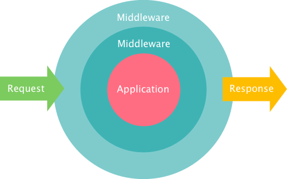
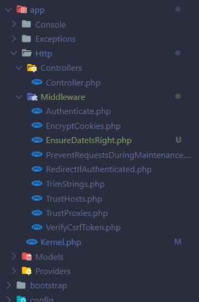
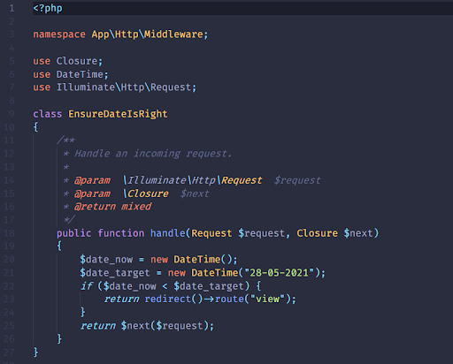
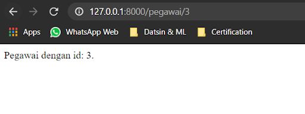
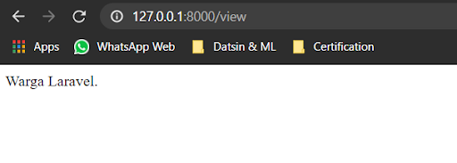

# Laravel Middleware

[Kembali](readme.md)

## Daftar Isi

-   [Laravel Middleware](#laravel-middleware)
    -   [Daftar Isi](#daftar-isi)
    -   [Latar Belakang Topik](#latar-belakang-topik)
    -   [Konsep-Konsep](#konsep-konsep)
    -   [Langkah-Langkah Tutorial](#langkah-langkah-tutorial)
        -   [Langkah Pertama](#langkah-pertama)
        -   [Langkah Kedua](#langkah-kedua)
        -   [Langkah Ketiga](#langkah-ketiga)
        -   [Langkah Keempat](#langkah-keempat)
        -   [Langkah Kelima](#langkah-kelima)
    -   [Kesimpulan](#kesimpulan)

## Latar Belakang Topik

Dalam mengakses route, terkadang kita perlu mengecek kembali kriteria akses. Misal, sebuah web memiliki route untuk anggota dan route untuk umum. Tentu, tidak mungkin orang umum diperbolehkan mengakses route yang dimiliki anggota karena bisa jadi orang luar akan mengambil data-data pribadi maupun masalah keamanan lainnya. Karena itu, diperlukan semacam pengecekan sebelum diberikan akses request terhadap route yang disebut middleware.



Dalam kesempatan kali ini, kita mencoba menggunakan route sebagai semacam link coming soon. Kita tidak dapat mengakses sebuah route jika tanggalnya kurang dari 27 Mei 2021. Nantinya, pengguna akan diarahkan ke laman named route “view” jika tidak sesuai.

Banyaknya fitur tersebut lah yang akan kita pelajari pada konsep Laravel Middleware.

## Konsep-Konsep

Konsep dari Laravel Middleware ini adalah dengan memberikan semacam pengecekan tengah sebelum request diteruskan ke aplikasi. Misal penggunaanya dalam membagi user dan public. Semisal kita membangun aplikasi yang bisa membuat blog, tentu tidak mungkin jika public diberikan kesempatan untuk membuat blog juga. Namun, public cukup diberikan kesempatan untuk membaca isi dari blog tersebut. Untuk melakukannya, sebelum mengakses route untuk membuat blog, user akan diarahkan untuk dicek apakah ia merupakan user atau tidak. Jika iya, maka pengguna dapat mengakses konten blog.

## Langkah-Langkah Tutorial

### Langkah Pertama

Untuk membuat middleware, pertama kita perlu membuat route yang ingin dipakaikan middleware. Pada contoh ini, kita membuat named route “view” sebagai redirect middleware dan route dengan prefix “/pegawai” sebagai route yang akan kita pakaikan middleware.

Pada file `routes\web.php`, kita melakukan koding route “/view” dengan diakhiri dengan method `name` untuk memberikan nama.

```php
Route::get("/view", function () {
    return "Warga Laravel.";
})->name("view");
```

Pada file yang sama pula, kita juga menambahkan prefix “/pegawai” dan kita gabungkan dalam group seperti pada tutorial [Laravel Route dengan Parameter](../laravel-route-dengan-parameter).

```php
Route::prefix("/pegawai")->group(function () {
    Route::get("/view", function () {
        return "Pegawai Laravel.";
    });
    Route::get("/{id}", function ($id) {
        return "Pegawai dengan id: " . $id . ".";
    })->whereNumber('id');
});
```

### Langkah Kedua

Jalankan command berikut untuk membuat file middleware baru.

```
php artisan make:middleware EnsureDateIsRight
```

Nantinya pada directory `App\Http\Middleware`, kita dapat melihat file `EnsureDateIsRight.php`



### Langkah Ketiga

Selanjutnya, pada file `App\Http\Middleware\EnsureDateIsRight.php`, kita dapat menambahkan pada fungsi handle sebagai berikut.

```php
public function handle(Request $request, Closure $next)
    {
        $date_now = new DateTime();
        $date_target = new DateTime("27-05-2021");
        if ($date_now < $date_target) {
            return redirect()->route("view");
        }
        return $next($request);
    }
```

Di sini, dapat dilihat, jika tanggal kurang dari 27-05-2021, maka middleware akan mengarahkan route kita kepada named route “view”.



### Langkah Keempat

Untuk memberikan nama terhadap middleware kita, buka file `App\Http\Kernel.php`, di sini pada state `$routeMiddleware` tambahkan kode berikut.

```php
'date' => \App\Http\Middleware\EnsureDateIsRight::class,
```

Di sini, kita akan membuat alias nama middleware pada kelas EnsureDateIsRight menjadi “date”.

### Langkah Kelima

Sekarang kita ubah prefix “/pegawai” tadi menjadi berikut.

```php
Route::middleware('date')->prefix("/pegawai")->group(function () {
    Route::get("/view", function () {
        return "Pegawai Laravel.";
    });
    Route::get("/{id}", function ($id) {
        return "Pegawai dengan id: " . $id . ".";
    })->whereNumber('id');
});
```

Hal tersebut berarti kita akan mengarahkan keseluruhan prefix “/pegawai” untuk menjalankan middleware “date”.

Sekarang, jika kita mencoba menjalankan Laravel, maka jika kita mencoba mengakses “/pegawai/{id}”.



Sekarang kita coba ubah kodingan $date_target pada file `App\Http\Middleware\EnsureDateIsRight.php` menjadi berikut.

```php
$date_target = new DateTime("28-05-2021");
```

Maka, jika kita mengakses “/pegawai/{id}”, kita akan diarahkan ke named route “view” karena tanggal ternyata belum 28-05-2021.



## Kesimpulan

Laravel Middleware berfungsi sebagai gate untuk menghubungkan request dari pengguna yang nantinya akan ditentukan apakah pengguna pantas untuk mengakses route yang diminta atau tidak.
