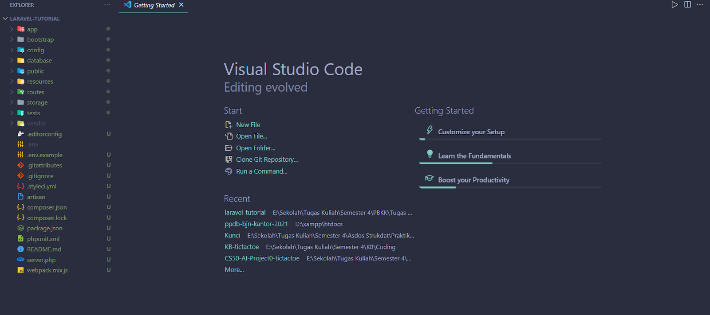
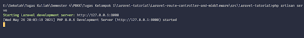
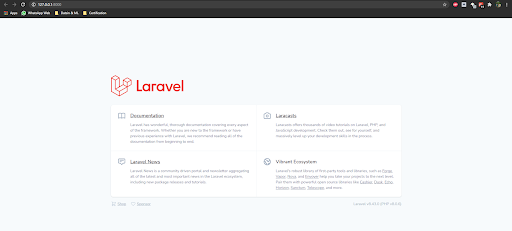
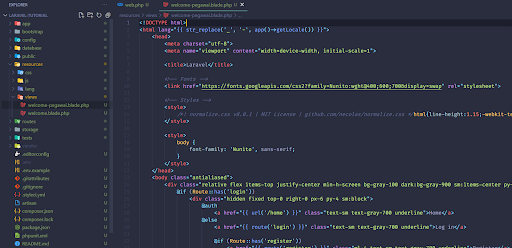
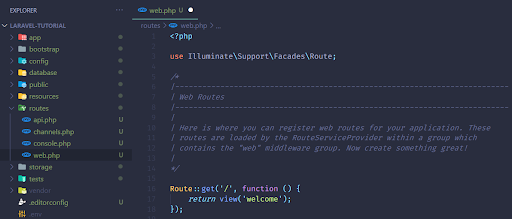
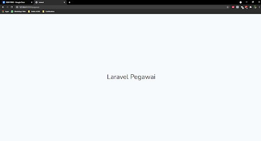

# Laravel Route Dasar

[Kembali](readme.md)

## Daftar Isi

-   [Laravel Route Dasar](#laravel-route-dasar)
    -   [Daftar Isi](#daftar-isi)
    -   [Latar Belakang Topik](#latar-belakang-topik)
    -   [Konsep-Konsep](#konsep-konsep)
    -   [Langkah-Langkah Tutorial](#langkah-langkah-tutorial)
        -   [Langkah Pertama](#langkah-pertama)
        -   [Langkah Kedua](#langkah-kedua)
        -   [Langkah Ketiga](#langkah-ketiga)
        -   [Langkah Keempat](#langkah-keempat)
        -   [Langkah Kelima](#langkah-kelima)
    -   [Kesimpulan](#kesimpulan)

## Latar Belakang Topik

Dalam mengakses sebuah web, route adalah bagian yang mengatur rute pada project aplikasi web. Hal paling mendasar pada route di Laravel adalah biasanya route menerima URI (sekuen karakter unik yang memberikan identifikasi terhadap teknologi web) serta closure (fungsi anonim). Penggunaan kedua hal tersebut akan memudahkan kita mengatur project Laravel nantinya.


Misal kita ingin membangun web. Tentu, agar lebih terorganisasi, kita ingin akses web kita dapat diakses selayaknya directory pada operating system. Pada contoh ini, kita akan membangun route di mana memberikan akses URI “/pegawai” yang menampilkan view welcome. Tentu untuk melakukan penggunaan itu, penggunaan route Laravel akan memudahkan dalam mengakses lokasi URI tersebut. Kita juga nantinya, dapat pula melakukan redirecting view misal dari “/employee” di mana employee dan pegawai memiliki arti yang sama agar bisa mengakses link pegawai pada akhirnya.

Banyaknya fitur tersebut lah yang akan kita pelajari pada konsep Laravel Route.

## Konsep-Konsep

Konsep dari Laravel Route ini akan terbagi menjadi dua, yakni route api dan route web. Route api ini secara otomatis akan menambahkan “/api” pada bagian awal router. Sedangkan, route web akan memberikan akses penuh terhadap route. Secara default keseluruhan file route ini dapat diakses pada directory “routes” tergantung apakah kita ingin mengakses web (`routes\web.php`) atau api (`routes\api.php`). Seluruh file pada route ini diatur secara otomatis oleh `App\Providers\RouteServiceProvider`.

## Langkah-Langkah Tutorial

### Langkah Pertama

Sebelum kita memulai project Laravel, kita dapat melakukan [instalasi Laravel](https://laravel.com/docs/8.x/installation). Terdapat banyak cara untuk menginstall project Laravel, namun di sini kita akan menggunakan composer.

```
composer create-project laravel/laravel laravel-tutorial

cd laravel-tutorial

php artisan serve
```

Nantinya, akan terbuat folder laravel-tutorial sebagai berikut.


Selain itu, setelah kita memasukkan command `php artisan serve` maka kita akan mendapatkan akses development server aplikasi Laravel seperti berikut.


Jika kita mengakses development server tersebut, maka kita dapatkan tampilan sebagai berikut.


### Langkah Kedua

Sekarang kita akan membangun contoh view sederhana untuk URI “/pegawai”. Di sini, kita mengakses `resources\views`. Akan terlihat file `welcome.blade.php`. Lakukan copy file tersebut dan hasilnya ganti menjadi `welcome-pegawai.blade.php`.


Setelah itu, ganti isi body menjadi:

```html
<body class="antialiased">
    <div
        class="relative flex items-top justify-center min-h-screen bg-gray-100 dark:bg-gray-900 sm:items-center py-4 sm:pt-0"
        style="font-size: 3em"
    >
        Laravel Pegawai
    </div>
</body>
```

### Langkah Ketiga

Setelah ini, kita mencoba untuk membangun router ke URI “/pegawai”. Di sini, mulanya kita membuat akses route pada file `routes\web.php`.


Dapat kita lihat bahwa di sini, terdapat class `Route` dengan method `get`. Ini merupakan method dalam melakukan akses HTTP terhadap web aplikasi Laravel. Dapat dilihat pula, parameter dari method ini sebagai berikut:
`‘/’` sebagai URI
`function()` sebagai Closure untuk menjalankan proses

Sekarang, kita menentukan [HTTP request method](https://developer.mozilla.org/en-US/docs/Web/HTTP/Methods) yang diinginkan. Karena kita hanya menampilkan data view sederhana kita akan memakai `GET` sebagai request method-nya. Selanjutnya, kita tinggal menggunakan kode berikut.

```php
Route::get('/pegawai', function () {
    return view('welcome-pegawai');
});
```

Langkah Ketiga - versi 2
Adapun karena kita hanya menampilkan view, kita juga dapat menggunakan method `view` yang nantinya mengambil parameter URI dan nama file view.

```php
Route::view("/pegawai", "welcome-pegawai");
```

### Langkah Keempat

Sekarang kita coba memanggil command `php artisan serve`. Maka tampilannya akan menjadi sebagai berikut.



### Langkah Kelima

Sekarang kita akan membuat redirect dari “/employee” menuju route “/pegawa”. Untuk melakukan hal ini, kembali ke file `routes\web.php`. Di sini, kita akan menggunakan method `redirect` yang mengambil dua parameter, yakni URI asal dan URI tujuan.

```
Route::redirect("/employee", "/pegawai");
```

Jika kita menjalankan command `php artisan serve` dan mengakses URI “/employee”, maka kita akan diarahkan segera ke route “/pegawai”.

## Kesimpulan

Penggunaan Laravel Route dapat membantu penggunaan akses web menjadi lebih terorganisasi. Keseluruhan kustomisasi Laravel Route tinggal diakses pada directory `routes` dan kita dapat melihat bermacam kemudahannya. Selain itu, class `Route` menyediakan method yang lengkap untuk memberikan bermacam model request yang dapat diajukan oleh developer.
