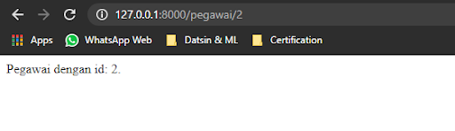
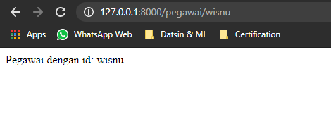
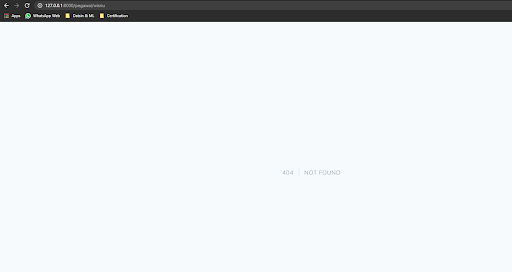
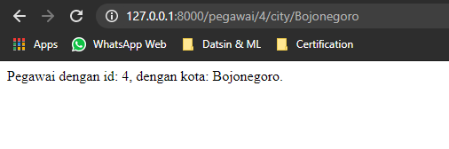
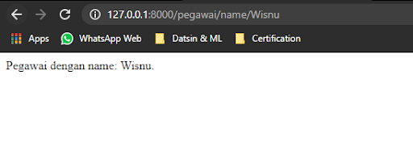

# Laravel Route Dengan Parameter

[Kembali](readme.md)

## Daftar Isi

-   [Laravel Route Dengan Parameter](#laravel-route-dengan-parameter)
    -   [Daftar Isi](#daftar-isi)
    -   [Latar Belakang Topik](#latar-belakang-topik)
    -   [Konsep-Konsep](#konsep-konsep)
    -   [Langkah-Langkah Tutorial](#langkah-langkah-tutorial)
        -   [Langkah Pertama](#langkah-pertama)
        -   [Langkah Kedua](#langkah-kedua)
        -   [Langkah Kedua - versi 2](#langkah-kedua---versi-2)
        -   [Langkah Ketiga](#langkah-ketiga)
    -   [Kesimpulan](#kesimpulan)

## Latar Belakang Topik

Dalam perkembangannya, terkadang kita ingin menggunakan URI sebagai tambahan informasi/parameter dari pengguna. Walaupun ada cara pengiriman data dengan menggunakan method `POST`. Namun, penggunaan ini berfungsi untuk memodifikasi data Pada contoh kali ini kita akan belajar cara akses data yang kita letakkan untuk hanya melakukan request dari pengguna.

Misalkan dalam sebuah directory operating system kita terdapat folder “pegawai” yang terdiri atas banyak sekali file yang terdiri dari angka 1-tak terhingga. Tentu untuk membuka setiap file tersebut, tidak mungkin jika kita harus menulis satu per satu akses directory setiap file ke dalam catatan kita. Maka dari itu, diperlukan sebuah parameter tambahan yang berfungsi untuk mengorganisasi akses route ke setiap directory, tanpa harus menulis route untuk setiap file.

Maka dari itu, kita akan memanggil route “/pegawai/{id}” yang nantinya cukup menampilkan view nama route tersebut dan parameter yang diberikan. Selain itu, untuk mencegah user melakukan akses parameter id berupa karakter angka, maka kita juga akan membatasi ekspresi id yang diberikan. Terakhir, kita akan melakukan grouping route jika nantinya melakukan scale up terhadap seluruh route Laravel.

Banyaknya fitur tersebut lah yang akan kita pelajari pada konsep Laravel Route dengan Parameter.

## Konsep-Konsep

Konsep dari Laravel Route dengan parameter ini adalah memberikan pengguna kemudahan dalam melakukan kustomisasi segmen pada route. Misal anggap saja dalam route terdapat “/pegawai/1” dan “/pegawai/2”. Dalam contoh sederhana, mungkin kita tinggal membuat fungsi route untuk masing-masing route tersebut. Namun, bagaimana jika route yang diberikan sampai “/pegawai/9999”. Tentu mustahil jika kita membuat fungsi sebanyak itu. Maka, dari itu, diperlukan parameter yang berfungsi menerima keseluruhan angka tersebut dan menjadikan sebuah route dengan request method khusus.

## Langkah-Langkah Tutorial

### Langkah Pertama

Untuk menambahkan parameter pada route, kita tinggal melakukannya pada file `routes\web.php`. Di sini, kita perlu menentukan model route yang akan kita pasang, contohnya “/pegawai/1”, dan seterusnya. Untuk memberi tahu Laravel bahwa angka 1 tersebut adalah parameter id, kita tinggal mengganti URI pada setiap method pada Route dengan “/pegawai/{id}”. Nantinya kita tinggal menambahkan `$id` sebagai parameter pada fungsi closure kita.

Kita cukup melihat nilai `$id` pegawai. Nantinya, kodingannya akan menjadi seperti berikut.

```php
Route::get("/pegawai/{id}", function ($id) {
    return "Pegawai dengan id: " . $id . ".";
});
```

Maka, tampilannya akan menjadi sebagai berikut.



### Langkah Kedua

Kini, permasalahan terjadi jika kita mengisi `$id` dengan string lain (bukan angka). Maka, id yang seharusnya hanya angka maka dapat menampilkan string.



Tentu hal tersebut menimbulkan permasalahan terbaru, jika id hanya terbatas pada angka. Untuk mengatasi hal tersebut, kita cukup menambahkan method `where` di mana mengambil string dari nama parameter dan [regular expression](https://developer.mozilla.org/en-US/docs/Web/JavaScript/Guide/Regular_Expressions/Cheatsheet) dari parameter. Jadinya sebagai berikut.

```
Route::get("/pegawai/{id}", function ($id) {
    return "Pegawai dengan id: " . $id . ".";
})->where('id', '[0-9]+');
```

Apabila kita mencoba mengakses kembali route tadi, kita akan dikembalikan pada laman 404.


Jika kita kesulitan dalam memahami regex, kita juga bisa menambahkan method khusus seperti `whereNumber` (hanya angka), `whereAlpha` (hanya alphabet), `whereAlphaNumeric` (hanya angka dan alphabet), atau `whereUuid` (hanya unsigned). Kodenya akan seperti berikut.

```
Route::get("/pegawai/{id}", function ($id) {
    return "Pegawai dengan id: " . $id . ".";
})->whereNumber('id');
```

Tampilannya pun akan sama dan memiliki pengembalian sama seperti di atas jika tidak sesuai.

### Langkah Kedua - versi 2

Kita juga dapat melakukan chaining terhadap route parameter semisal kita ingin mengambil lebih dari satu parameter. Misal kita ingin memanggil URI “/pegawai/{id}/city/{city}”. Jika kita ingin membatasi id hanya berupa angka dan city hanya berupa alphabet. Di sini, kita dapat memanggil sebagai berikut.

```
Route::get("/pegawai/{id}/city/{city}", function ($id, $city) {
    return "Pegawai dengan id: " . $id . ", dengan kota: " . $city . ".";
})->where(['id' => '[0-9]+', 'city' => '[a-z]+']);
```

Atau bisa diubah menjadi chaining method berikut.

```
Route::get("/pegawai/{id}/city/{city}", function ($id, $city) {
    return "Pegawai dengan id: " . $id . ", dengan kota: " . $city . ".";
})->whereNumber('id')->whereAlpha('city');
```

Tampilannya akan menjadi seperti berikut.


### Langkah Ketiga

Apabila route yang dimiliki semakin banyak, tentu kita akan kebingungan untuk mengatur semakin banyaknya route yang ada. Maka dari itu, diperlukan namanya route groups. Misal kita membangun route “/pegawai/view”, “/pegawai/{id}”, “/pegawai/name/{name}”, dan seterusnya. Ketiga route tersebut memiliki kesamaan yakni menggunakan prefix “pegawai”. Maka, kita tinggal memakai prefix “pegawai” serta melakukan group terhadap seluruh prefix “pegawai”.

Di sini, kita cukup memakai method `prefix` dan method `group` untuk melakukan hal di atas. Method `prefix` mengambil parameter prefix URI dan method `group` memanggil fungsi callback.

```php
Route::prefix("/pegawai")->group(function () {
    Route::get("/view", function () {
        return "Pegawai Laravel.";
    });
    Route::get("/{id}", function ($id) {
        return "Pegawai dengan id: " . $id . ".";
    })->whereNumber('id');
    Route::get("/name/{name}", function ($name) {
        return "Pegawai dengan name: " . $name . ".";
    })->whereAlpha('name');
});
```

Selanjutnya, kita tinggal mengakses URI tersebut.


## Kesimpulan

Laravel Route dengan parameter memberikan kesempatan aplikasi untuk mengambil data melalui segmen URI. Selain itu, kita dapat pula membatasi segmen URI seperti apa yang akan diambil oleh aplikasi dengan method `where` di mana memberikan akses bebas terhadap regex yang diambil. Tak hanya itu, untuk memudahkan scale up routing web, Laravel menyediakan method `prefix` dan `group`.
