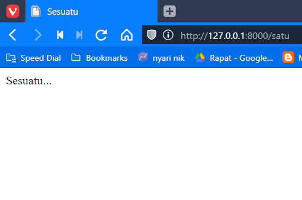

# Laravel Views

[Kembali](readme.md)

## Latar Belakang Topik

Untuk mempermudah perawatan suatu aplikasi, biasanya terdapat pemisahan terhadap bagian logika bisnis dan juga bagian presentasi atau bagian yang ditampilkan ke pengguna. Pada Laravel, untuk bagian presentasi ini ditangani oleh View. Sebenarnya kita bisa saja langsung menuliskan kode HTML pada route ataupun controller, namun hal ini akan membuat perawatan aplikasi menjadi semakin sulit. View pada Laravel ini biasanya disimpan di folder `resource/views`, dan biasanya berisi kode HTML.

## Konsep-konsep

Misal: jelaskan mengenai pengertian, konsep, alur, dll.
Laravel merupakan kerangka kerja berbasis MVC, dimana dalam V dalam MVC tersebut merupakan kependekan dari View. View ini adalah data yang akan ditampilkan kepada pengguna pada browser mereka dan pengguna juga dapat berinteraksi dengan View ini.
Pada tutorial di bawah akan dijelaskan cara membuat, menampilkan, dan memberikan data ke dalam View. 

## Langkah-langkah Tutorial

### Langkah Pertama

Langkah pertama yaitu membuat view. Untuk membuat view, kita dapat langsung membuat file pada folder `resource/views`. Nama yang diberikan harus diakhiri dengan `.blade.php` untuk dapat menggunakan templating engine Laravel yaitu Blade.


### Langkah Kedua

Setelah membuat file view, selanjutnya kita bisa mulai mengisi file tersebut dengan kode HTML dan merender view tersebut dengan menggunakan global `view` helper.

```php
Route::get('/normal', function () {
    return view('view1');
});
```

Selain menggunakan helper `view`, kita juga dapat menggunakan `View` facade

```php
use Illuminate\Support\Facades\View;

Route::get('/dengan_facade', function () {
    return View::make('view1');
});
```

Berikut adalah isi dari file `view1.blade.php` dan hasil yang ditampilkan pada browser.
```html
<!DOCTYPE html>
<html lang="en">
<head>
    <meta charset="UTF-8">
    <meta http-equiv="X-UA-Compatible" content="IE=edge">
    <meta name="viewport" content="width=device-width, initial-scale=1.0">
    <title>Sesuatu</title>
</head>
<body>
    Sesuatu...
</body>
</html>
```


### Langkah Ketiga

Isi dari view yang kita tampilkan bisa saja berubah sesuai dengan data yang diinginkan. Kita dapat memberikan data ke dalam view yang dapat ditampilkan dengan bantuan templating engine Blade.
Untuk mengirimkan data ke view, dapat digunakan beberapa cara :
- Menggunakan Associative Array:

```php
Route::get('/passing_array', function () {
    return view('view1', ['something' => 'Passing Value dengan Array']);
});
```
- Menggunakan fungsi `with` milik `view` helper:

```php
Route::get('/passing_with', function () {
    return view('view1')->with('something', 'Passing Value dengan With');
});
```

- Menggunakan fungsi `compact` PHP:
Fungsi ini membuat array yang mengandung variable dan nilai dari variable itu.
```php
Route::get('/passing_compact', function () {
    $something = 'Passing Value dengan Compact';
    return view('view1', compact('something'));
});
```