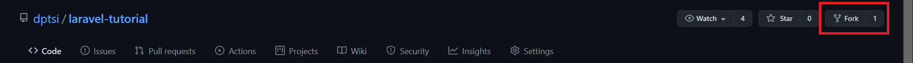
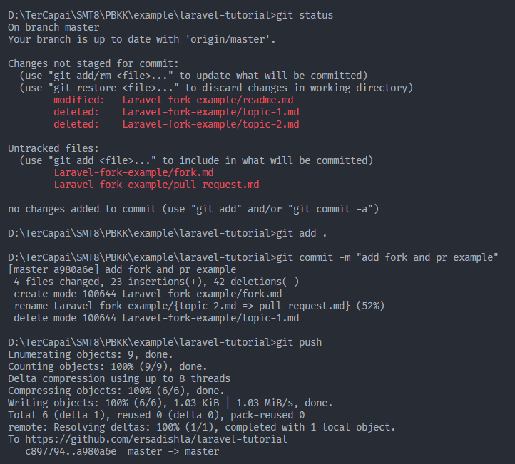
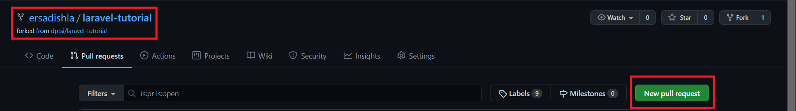
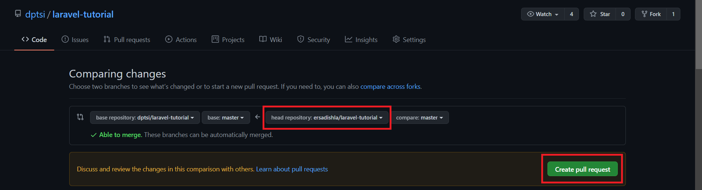
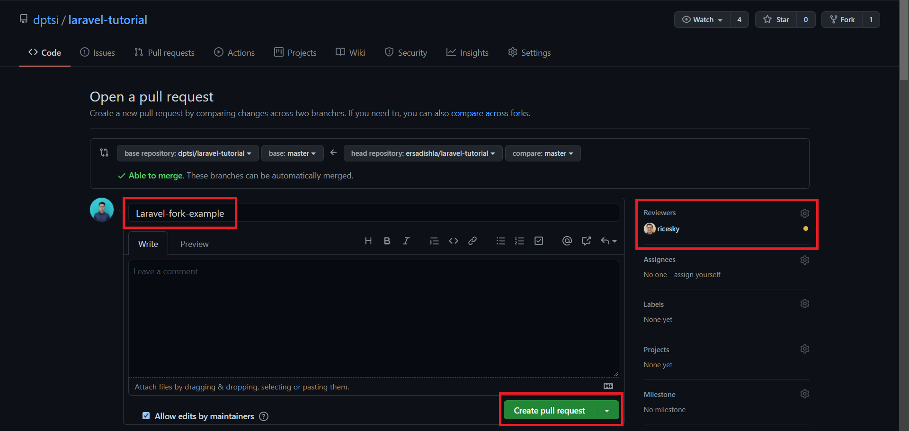
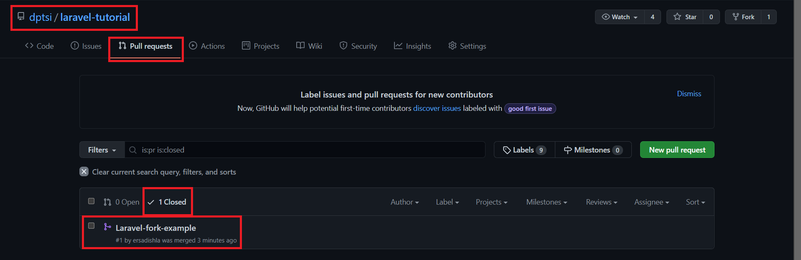

# Laravel Tutorial

## Daftar isi

- [Object oriented PHP 1](Object-oriented-PHP-1/readme.md)
- [Object oriented PHP 2](Object-oriented-PHP-2/readme.md)
- [Object oriented PHP 3](Object-oriented-PHP-3/readme.md)
- [Laravel route, controller and middleware](Laravel-route-controller-and-middleware/readme.md)
- [Laravel request, validation and response](Laravel-request-validation-and-response/readme.md)
- [Laravel model, eloquent and query builder](Laravel-model-eloquent-and-query-builder/readme.md)
- [Laravel authentication and authorization](Laravel-authentication-and-authorization/readme.md)
- [Laravel localization and file storage](Laravel-localization-and-file-storage/readme.md)
- [Laravel view and blade component](Laravel-view-and-blade-component/readme.md)
- [Laravel session and caching](Laravel-session-and-caching/readme.md)
- [Laravel jobs and queue](Laravel-jobs-and-queue/readme.md)
- [Laravel command and scheduling](Laravel-command-and-scheduling/readme.md)
- [Laravel event and listener](Laravel-event-and-listener/readme.md)
- [Laravel contracts and facade](Laravel-contracts-and-facade/readme.md)
- [Laravel broadcasting](Laravel-broadcasting/readme.md)
- [Laravel feature testing and unit testing](Laravel-feature-testing-and-unit-testing/readme.md)
- [Laravel composer package](Laravel-composer-package/readme.md)

## Catatan

- Pembagian kelompok dan materi dapat dilihat di [link ini](https://docs.google.com/spreadsheets/d/1veoJvnwTS8INEodXPWJ65GWscV7bupEIdI65GZVa6GU/edit?usp=sharing).
- Jika 1 materi terdiri dari lebih dari 1 topik, buat markdown baru dengan sesuai dengan nama topik.
- Presentasi langsung menggunakan `readme.md` pada masing-masing materi.
- Cara pembuatan markdown dapat dilihat di [link ini](https://www.markdownguide.org/cheat-sheet/) atau [link ini](https://github.com/adam-p/markdown-here/wiki/Markdown-Cheatsheet).

## Petunjuk

1. Fork repository ini.

    

2. Pada repository hasil fork lakukan perubahan sesuai dengan materi yang telah dibagi dan menggunakan template yang telah disediakan. Kemudian commit dan push.
    - Contoh struktur

        ```bash
        .
        └── Laravel-request-validation-and-response
            ├── readme.md
            ├── src
            ├── laravel-request.md
            ├── laravel-validation.md
            └── laravel-response.md
        ```

    - Contoh perubahan
    

3. Pada repository hasil fork lakukan *Pull Request* sebelum presentasi.

    - Buka repository hasil fork klik pada tab `Pull requests`, kemudian klik tombol `New pull request`.
    

    - Pastikan reposity benar, kemudian klik `Create pull request`.
    

    - Isi `Title` dengan nama materi yang dipresentasi (nama direktori yang kebab case),  kemudian klik `Create pull request`.
    

    - Pada repository asli ketika reviewer telah ACC pull request yang dilakukan, maka riwayat pull request akan muncul pada tab `Closed`.
    
